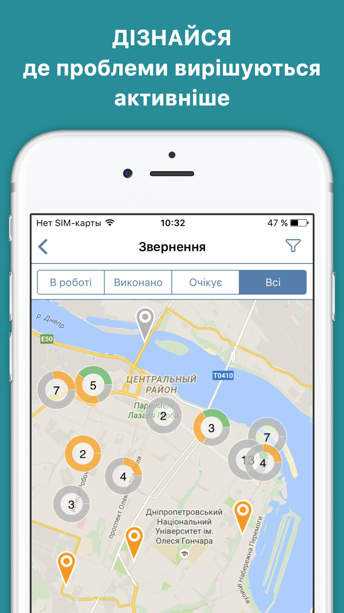
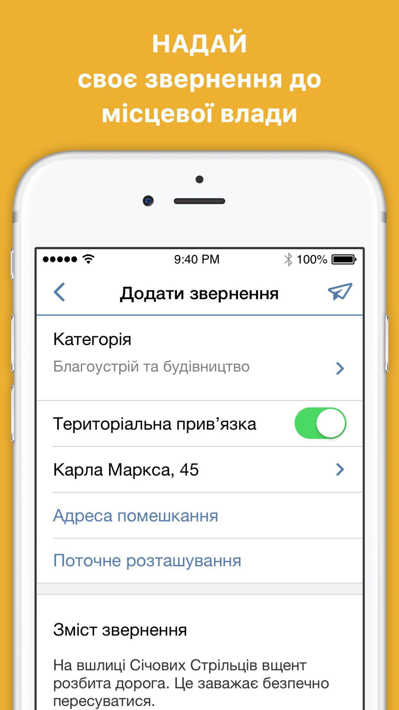
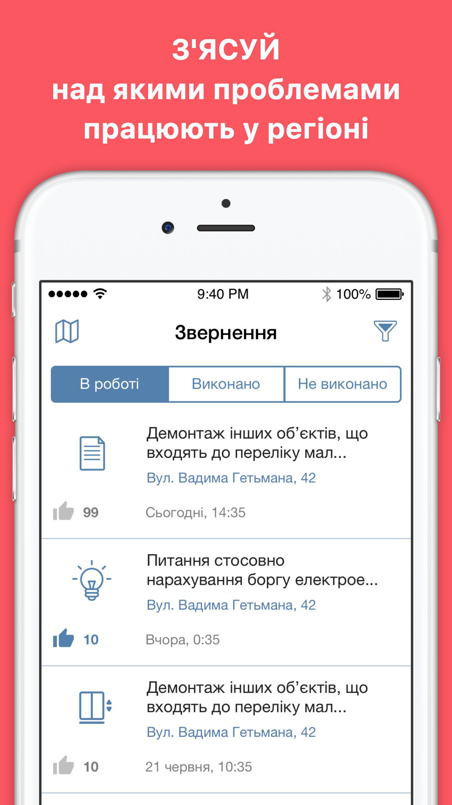

## E-contact - iOS application for a pre-existing regional government service

E-contact app helps citizens of Dnipro and neighboring regions to solve problems citizens have in their everyday lives by providing a reliable channel of communication with local authorities. 
Citizens don’t have to know exactly who they should get in touch with – a contact center forwards their complaint to whoever is the responsible branch of local authorities.
Let’s say, a road in your district needs repairs, or elevator is not working in your building or gas pipes are leaking.E-contact will help you will all these issues!
You can use E-contact to learn what residents of your town or village complain about through the feed or an integrated map that reflects all complaints with their geolocation. 
You can add your own complaint stating the problem in text format with photos attached and a spot of the map linked to your post.
E-contact will deliver the complaint to the responsible party and will notify you as soon as the issue is fixed.

## Technology Stack

Continuous Integration -  Xcode Server
Crashlog - Crashlitics
Build delivery - Fabric
Database - Core Data
Serverside - Parse server
Development tools - UIKit, Swift, Objective C.

## Used libraries

[**Magical Record**](https://github.com/magicalpanda/MagicalRecord) - Super Awesome Easy Fetching for Core Data.

[**Toast**](https://github.com/scalessec/Toast) - An Objective-C category that adds toast notifications to the UIView object class.

[**Fast Easy Mapping**](https://github.com/Yalantis/FastEasyMapping) - A tool for fast serializing & deserializing of JSON.

[**Alamofire**](https://github.com/Alamofire/Alamofire) - Elegant HTTP Networking in Swift.

[**Google Maps**](https://developers.google.com/maps/documentation/ios-sdk/) - The best of Google Maps for every iOS app.

[**ImagePicker**](https://github.com/hyperoslo/ImagePicker) - ImagePicker is an all-in-one camera solution for your iOS app.

[**RSKImageCropper**](https://github.com/ruslanskorb/RSKImageCropper) - An image cropper / photo cropper for iOS.

[**Haneke Swift**](https://github.com/Haneke/HanekeSwift) - A lightweight generic cache for iOS written in Swift with extra love for images..

[**Keychain Access**](https://github.com/kishikawakatsumi/KeychainAccess) - Simple Swift wrapper for Keychain that works on iOS and OS X.

[**Device Kit**](https://github.com/dennisweissmann/DeviceKit) - DeviceKit is a value-type replacement of UIDevice.

## Let us know!

We’d be really happy if you sent us links to your projects where you use our source code. Just send an email to github@yalantis.com And do let us know if you have any questions or suggestion regarding the application.

## License

The MIT License (MIT)

Copyright © 2016 Yalantis

Permission is hereby granted, free of charge, to any person obtaining a copy
of this software and associated documentation files (the "Software"), to deal
in the Software without restriction, including without limitation the rights
to use, copy, modify, merge, publish, distribute, sublicense, and/or sell
copies of the Software, and to permit persons to whom the Software is
furnished to do so, subject to the following conditions:

The above copyright notice and this permission notice shall be included in
all copies or substantial portions of the Software.

THE SOFTWARE IS PROVIDED "AS IS", WITHOUT WARRANTY OF ANY KIND, EXPRESS OR
IMPLIED, INCLUDING BUT NOT LIMITED TO THE WARRANTIES OF MERCHANTABILITY,
FITNESS FOR A PARTICULAR PURPOSE AND NONINFRINGEMENT. IN NO EVENT SHALL THE
AUTHORS OR COPYRIGHT HOLDERS BE LIABLE FOR ANY CLAIM, DAMAGES OR OTHER
LIABILITY, WHETHER IN AN ACTION OF CONTRACT, TORT OR OTHERWISE, ARISING FROM,
OUT OF OR IN CONNECTION WITH THE SOFTWARE OR THE USE OR OTHER DEALINGS IN
THE SOFTWARE.

